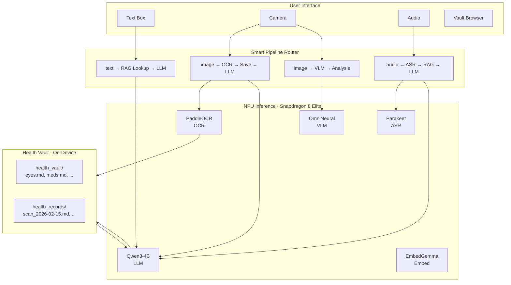

# Health Passport

> **Qualcomm x Nexa On-Device AI Bounty** · Snapdragon 8 Elite · Feb 2026

Privacy-first medical records on your phone. Talk, scan, or type — six AI models run entirely on-device via NexaSDK on Qualcomm Hexagon NPU. No internet. No cloud. No HIPAA liability.

[](https://carlkho-minerva.github.io/health-passport-android/)

---

## The Problem

I rotate across seven global cities every semester as a Minerva student. Manila, Mumbai, Taipei, San Francisco. Each new country means re-explaining my complete medical history — prescriptions buried in camera roll photos, lab reports in three languages, no structured record I can hand a doctor.

This affects 50M+ international travelers. Medical continuity breaks at every border. Existing health apps require cloud upload, creating compliance nightmares across jurisdictions.

## The Solution

Six NPU-accelerated models running on Snapdragon 8 Elite, auto-downloaded on first launch:

| Model | Role | Speed |
|-------|------|-------|
| **Qwen3-4B Instruct** | Brain — text Q&A | 19 tok/s decode, 1049 tok/s prefill |
| **PaddleOCR** | Document scanner | < 1s per page |
| **Parakeet ASR** | Speech-to-text | Real-time |
| **OmniNeural-4B** | Vision analysis | ~15 tok/s |
| **EmbedGemma** | Memory / embeddings | Instant |
| **Llama-3.2-3B Turbo** | Alternate LLM | ~15 tok/s |

First launch shows a setup modal that auto-downloads the three essential models (LLM + OCR + ASR). No model picker, no configuration — the app routes input to the right model automatically.

---

## Architecture



---

## What You Can Do

**Conversational queries** — "What's my current eye prescription?", "List my active medications", "Show my February health timeline." Responses stream in real-time from your local Health Vault using RAG.

**Document scanning** — Point the camera at a prescription or lab report. PaddleOCR extracts the text, saves it to the vault, then the LLM analyzes it. One tap.

**Voice input** — Speak naturally. Parakeet ASR transcribes, the app searches your vault, and the LLM answers. Same chat interface as text.

**Vision analysis** — Attach a photo and ask "what's in this image?" OmniNeural-4B describes what it sees.

**Vault browsing** — Browse by body system, timeline, or protocol. Every file is markdown. Tap to view, edit, save. No proprietary formats.

---

## Technical Stack

| Component | Details |
|-----------|---------|
| SDK | `ai.nexa:core:0.0.24` with NPU (273) + CPU/GPU (17) plugins |
| Language | Kotlin 1.9.22 |
| Target | API 34 (min API 27) |
| UI | Material Design 3, custom dark theme |
| Markdown | Markwon v4.6.2 (tables, strikethrough, linkify) |
| Architecture | Single-activity, coroutine-based model management |

### Color Palette

```
#070707  background     #0D0D0D  surface
#111111  card           #F2F2F2  text
#808080  secondary      #4D4D4D  tertiary
#10B981  accent green   #1A1A1A  border
```

### Health Vault Structure

```
assets/health_vault/
  01_Body_Systems/   — eyes, cardiovascular, allergies
  02_Timeline/       — chronological medical events
  03_Protocols/      — active medications, routines
  04_System_Prompt/  — RAG system prompt
```

---

## Building

```bash
# Prerequisites: OpenJDK 17+, Android SDK API 27-34, ARM64 device

./gradlew assembleDebug
adb install app/build/outputs/apk/debug/app-debug.apk
```

## Demo

[carlkho-minerva.github.io/health-passport-android](https://carlkho-minerva.github.io/health-passport-android/)

---

## Project Structure

```
app/src/main/
  java/com/nexa/demo/
    MainActivity.kt (~3850 lines)
      checkFirstLaunch()      — Auto-download setup modal
      showSetupModal()        — Welcome + sequential model install
      downloadModelSuspend()  — Coroutine-bridged download
      loadModel()             — Type-specific model loading
      streamResponseToChat()  — Real-time token streaming
      handlePreloadedQuery()  — RAG response handlers
      browseVaultFolder()     — Recursive file browser
      showFileContent()       — Markdown viewer + editor
    ChatAdapter.kt
  res/
    layout/activity_main.xml
    values/colors.xml, themes.xml
    drawable/btn_*.xml
  assets/health_vault/
```

---

## Performance (Snapdragon 8 Elite)

| Metric | Value |
|--------|-------|
| Time to First Token | 446 ms |
| Prefill Throughput | 1,049 tok/s |
| Decode Throughput | 19 tok/s |
| Average Response | ~220 tokens |
| OCR Scan Time | < 1 second |
| APK Size | 299 MB |
| Concurrent NPU Models | Up to 6 |

---

## Development Context

**Carl Vincent Kho** · Minerva University '26 · kho@uni.minerva.edu

The vault structure comes from my [md-health](../../../md-health/) system — a markdown-based health knowledge base I've maintained across seven countries. This app makes that system conversationally queryable, entirely on-device.

---

## License

Apache 2.0

## Links

- [NexaSDK](https://nexa.ai)
- [Qualcomm AI](https://www.qualcomm.com/developer)
- [Architecture & Plan](docs/PLAN.md)

---

NexaSDK v0.0.24 · Kotlin 1.9.22 · Snapdragon 8 Elite · Material Design 3 · Markwon 4.6.2
