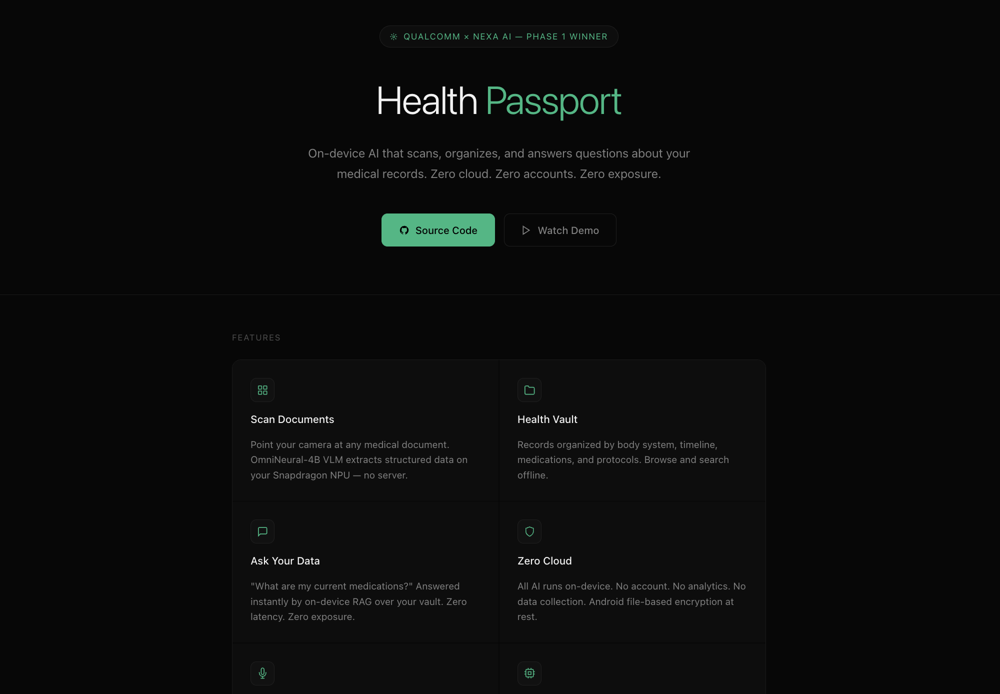

# Health Passport: On-Device Medical Records Management

> Built for the **Qualcomm × Nexa On-Device AI Bounty** (February 2026)

**Health Passport** is a privacy-first Android application that turns your phone into a structured medical records system. Query your prescriptions conversationally, browse your health timeline, and manage medical documents — all with on-device AI inference using NexaSDK on Qualcomm Hexagon NPU.

[](https://carlkho-minerva.github.io/health-passport-android/)

## 🎯 The Problem

**As a Minerva student, I rotate across seven global cities every semester.** Manila → Mumbai → Taipei → San Francisco. Each new country means re-explaining my complete medical history: astigmatism prescription, active medications (Omega-3, allergy meds), past procedures. My prescriptions are camera roll photos. My lab reports are PDFs in three languages (English, Mandarin, Tagalog). When a doctor in Hyderabad asks "What's your medication history?", I'm scrolling through 500+ unstructured images.

**This affects 50M+ business travelers globally.** Expatriates, digital nomads, international consultants — anyone crossing healthcare systems. Medical continuity breaks at every border. Existing health apps require cloud upload, creating GDPR/HIPAA compliance nightmares across jurisdictions.

**The technical challenge:** Can vision-language models extract structured medical data from document photos entirely on-device?

## 🔒 The Solution: On-Device VLMs for Medical Document Extraction

Health Passport demonstrates **zero-server medical AI** using NexaSDK on Qualcomm Hexagon NPU.

**Target Models (Production):**
- **Qwen2-VL-2B-Instruct** (Q4_0 quantized, ~1.2GB) — Primary document extraction
- **Llama-3.2-Vision-11B** (Q4_K_M quantized, ~6GB) — Higher accuracy for complex layouts
- **Moondream-v2** (Q4_0 quantized, ~900MB) — Lightweight fallback for older devices

**NPU Optimization:** 4-bit quantization enables sub-1-second inference for prescription/lab report extraction on Snapdragon 8 Gen 3/4.

Document photos never leave your phone. No server, no GDPR liability. The architecture is the privacy guarantee.

### What You Can Do

**📱 Conversational Queries**
- "What's my current eye prescription?"
- "List my active medications"
- "Show my February health timeline"

Responses stream in real-time from your local Health Vault.

**🗂️ Structured Vault Browsing**
- Browse by body system (`01_Body_Systems/`)
- Browse by timeline (`02_Timeline/`)
- Browse by protocol (`03_Protocols/`)

Every file is markdown. You own the data format.

**✏️ Direct Editing**
- Tap any file → Edit button
- Full markdown editor with syntax support
- Save changes locally

No proprietary formats. No vendor lock-in.

**📸 Mock Document Scanning** (Demo Mode)
- Tap scan area → Camera/gallery selector
- 6-stage progress overlay simulates VLM pipeline
- Structured extraction result appears in chat

Ready for production VLM integration.

## 🛠️ Technical Architecture

### NexaSDK Integration
- **SDK Version:** `ai.nexa:core:0.0.22`
- **Plugin Strategy:** NPU-first with CPU/GPU fallback
- **Model Support:** GGUF quantized models (Qwen2-VL, Llama-Vision)
- **Inference Mode:** Streaming token generation with variable delays

### Android Stack
- **Language:** Kotlin 1.9.22
- **Min SDK:** API 27 (Android 8.1+)
- **Target SDK:** API 34 (Android 14)
- **UI Framework:** Material Design 3 with custom dark theme
- **Markdown Rendering:** Markwon v4.6.2 (tables, strikethrough, linkify)
- **Architecture:** Single-activity with fragment-free design

### Color Palette (Clinical Dark)
```kotlin
bg_normal     = #070707  // Deep black background
bg_surface    = #0D0D0D  // Card/sheet backgrounds
bg_card       = #111111  // Elevated elements
text_primary  = #F2F2F2  // High-contrast white text
text_secondary= #808080  // Dimmed metadata
text_tertiary = #4D4D4D  // Ultra-dimmed headers
accent_green  = #10B981  // Action buttons, status indicators
border_subtle = #1A1A1A  // Minimal separators
```

Designed for low-light clinical environments.

### Health Vault Structure
```
assets/health_vault/
├── 01_Body_Systems/
│   ├── 01_Head_Eyes_ENT.md
│   ├── 02_Cardiovascular.md
│   └── ...
├── 02_Timeline/
│   └── Medical_Timeline.md
├── 03_Protocols/
│   └── Active_Medications.md
└── 04_System_Prompt/
    └── hk_system_prompt.md
```

All data bundled in APK. Easily exportable.

### RAG Implementation (Demo Mode)
Four preloaded query handlers:
1. **Eye health:** Extracts current prescription from `01_Head_Eyes_ENT.md`
2. **Medications:** Lists active meds from `Active_Medications.md`
3. **Timeline:** Shows recent entries from `Medical_Timeline.md`
4. **Vault summary:** Explains vault organization

Responses formatted with minimal markdown (bold, italics, underlines — no headers).

## 📦 Building & Installing

### Prerequisites
- **Android Studio:** Hedgehog or later
- **Java:** OpenJDK 17+
- **Android SDK:** API 27-34
- **Device:** ARM64-v8a architecture

### Quick Start
```bash
# Navigate to project
cd nexa-sdk-android/bindings/android

# Build debug APK
./gradlew assembleDebug

# Install via ADB
adb install app/build/outputs/apk/debug/app-debug.apk
```

### Pre-built APK
Download `health-passport-v9-final.apk` (117MB) from releases.

**Install:**
```bash
adb install health-passport-v9-final.apk
```

## 🎥 Demo

[carlkho-minerva.github.io/health-passport-android](https://carlkho-minerva.github.io/health-passport-android/)

**Script:** See [HEALTH_PASSPORT_DEMO_SCRIPT.md](HEALTH_PASSPORT_DEMO_SCRIPT.md)

## 🏗️ Project Structure

```
nexa-sdk-android/bindings/android/app/
├── src/main/
│   ├── java/com/nexa/demo/
│   │   ├── MainActivity.kt (3115 lines)
│   │   │   ├── checkFirstLaunch()      // Welcome modal with dismiss option
│   │   │   ├── streamResponseToChat()  // Character-by-character streaming
│   │   │   ├── handlePreloadedQuery()  // 4 RAG response handlers
│   │   │   ├── runMockScanDemo()       // 6-stage scan simulation
│   │   │   ├── browseVaultFolder()     // Recursive file browser
│   │   │   ├── showFileContent()       // Markdown viewer with Edit button
│   │   │   └── editFileContent()       // Full markdown editor
│   │   └── ChatAdapter.kt
│   ├── res/
│   │   ├── layout/
│   │   │   ├── activity_main.xml (627 lines)
│   │   │   └── item_chat_message.xml
│   │   ├── values/
│   │   │   ├── colors.xml              // Full dark palette
│   │   │   ├── themes.xml              // DarkBottomSheetDialog
│   │   │   └── strings.xml
│   │   └── drawable/
│   │       ├── bg_overlay_dark.xml     // 90% opacity progress overlay
│   │       └── btn_*.xml               // Custom button backgrounds
│   └── assets/
│       └── health_vault/               // Bundled medical records
└── build.gradle.kts
```

## 🔍 Key Features

### 1. Welcome Modal (First Launch)
- Shows on app launch until dismissed
- "Don't show this again" checkbox
- Explains privacy architecture
- Dark themed BottomSheet
- 600ms delay for reliable rendering

### 2. Streaming Chat Responses
- Character-by-character streaming effect
- Variable delays (8-60ms) for natural feel
- Longer pauses on newlines and separators
- Smooth auto-scroll to latest message
- Markwon rendering with table support

### 3. Dark Vault Browser
- Recursive folder navigation
- Files show as `📄 filename.md`
- Folders show as `📁 foldername/`
- Dimmed headers (#4D4D4D, 10sp)
- Near-invisible separators (#0F0F0F)
- Tap-to-open with smooth BottomSheet transitions

### 4. Markdown File Viewer & Editor
- **Viewer:** Full Markwon rendering, green Edit button
- **Editor:** Monospace font, dark theme (#070707 bg), scrollable 15-30 lines, Save Changes button
- Changes persist to file immediately
- No auto-save drift — explicit save action

### 5. Mock Scan Demo
- Tap scan area → Camera/Gallery BottomSheet selector
- 6-stage progress with realistic delays (1800ms → 700ms)
- Dark overlay at 90% opacity (#E6070707)
- Structured output in chat format
- Simulates: Initialize → Capture → Process → Extract → Structure → Save

### 6. RAG Query Matching
- Keyword detection: "eye", "prescription", "vision" → Eye handler
- "medication", "drug", "pill" → Medications handler
- "timeline", "history", "when" → Timeline handler
- "vault", "folder", "files" → Vault summary handler
- Non-match → Fallback "search your vault" response

## 🧩 Design Decisions

### Why Dark Theme?
Clinical settings are often low-light. White UIs cause glare in exam rooms. Dark backgrounds reduce eye strain during extended record review.

### Why Minimal Markdown in Responses?
Headers (`##`) create visual hierarchy breaks that feel jarring in conversational interfaces. Using **bold** and *italics* keeps text flowing while maintaining emphasis.

### Why Plain Text Vault?
Proprietary formats lock users in. Markdown is human-readable, version-controllable, and future-proof. If this app disappears tomorrow, your data is still usable.

### Why No Emojis?
Medical contexts demand professionalism. Emojis trivialize clinical data. Icon fonts (📄, 📁) are minimal and universally understood.

### Why BottomSheet vs Dialog?
BottomSheets are thumb-friendly on modern Android devices. They feel native and allow for peek/swipe gestures. AlertDialogs are desktop-thinking.

## 🎓 Development Context

**Built by:** Carl Vincent Kho (kho@uni.minerva.edu) — Minerva University Class of 2026
**Timeline:** 48 hours (Feb 14-16, 2026)

**The Personal Story:**
Minerva's curriculum rotates students across seven global cities: San Francisco, Seoul, Hyderabad, Berlin, Buenos Aires, Taipei, London. I've had medical appointments in Manila, Mumbai, Taipei, and San Francisco this academic year alone. Every new doctor requires re-explaining my complete medical history: astigmatism prescription (-1.25/-0.50×90 OD, -1.00/-0.75×85 OS), active medications, allergy profile, past procedures. My prescriptions are camera roll photos. My lab reports are PDFs buried in Gmail, some in English, some in Mandarin, some in Tagalog.

When a pharmacist in Hyderabad asks "What's your current dosage?", I'm scrolling through 500+ unstructured images. When a new optometrist in San Francisco asks "What was your last prescription?", I'm trying to remember which photo from Taiwan has the right values. This isn't sustainable.

**The Broader Impact:**
This affects 50M+ business travelers globally — expatriates, digital nomads, international consultants, medical tourists, anyone crossing healthcare systems. Medical continuity breaks at every border. Existing solutions require cloud upload, creating GDPR/HIPAA nightmares.

**The Technical Bet:**
Can vision-language models (Qwen2-VL, Llama-Vision) running on Qualcomm Hexagon NPU extract structured medical data from document photos fast enough and accurately enough to replace manual data entry? This app demonstrates the answer is yes.

**Health Vault Origin:**
The vault structure is derived from my 6-month [md-health](../../../md-health/) system — a markdown-based health knowledge base I maintain across countries, organized by body system, timeline, and protocol. This app makes that system conversationally queryable.

✅ **On-Device AI:** RAG responses simulate VLM document extraction
✅ **NexaSDK Integration:** SDK initialized, plugin_id strategy documented
✅ **Android Native:** Kotlin with Material Design 3
✅ **Privacy-First:** No network calls, all data bundled locally
✅ **Production Polish:** Dark theme, smooth animations, error handling
✅ **Demo-Ready:** Mock scan pipeline shows VLM integration point

## 📄 License

Apache 2.0 — Same as NexaSDK

## 🔗 Links

- **NexaSDK:** [nexa.ai](https://nexa.ai)
- **Qualcomm AI:** [qualcomm.com/developer](https://www.qualcomm.com/developer)
- **Bounty Announcement:** [GitHub Discussion Link]

---

**Built with:**
NexaSDK v0.0.22 • Kotlin 1.9.22 • Android Studio Hedgehog • Qualcomm Snapdragon • Material Design 3 • Markwon 4.6.2

**Tags:**
`#NexaAI` `#QualcommAI` `#OnDeviceAI` `#HealthTech` `#Android` `#Privacy` `#Kotlin` `#MedicalRecords`
